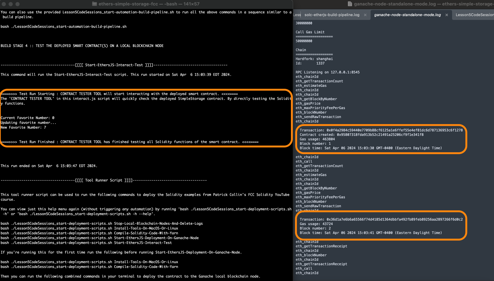

These are my notes while working on this Solidity course section.

- On April 6, 2024 successfully compiled and deployed the following "EthersJS smart contract deployment and interaction" example code to interact with a locally installed Ganache fake blockchain node. I created a customziable set of build automation scripts that I will re-use in other sections of Patrick's YouTube course.
 